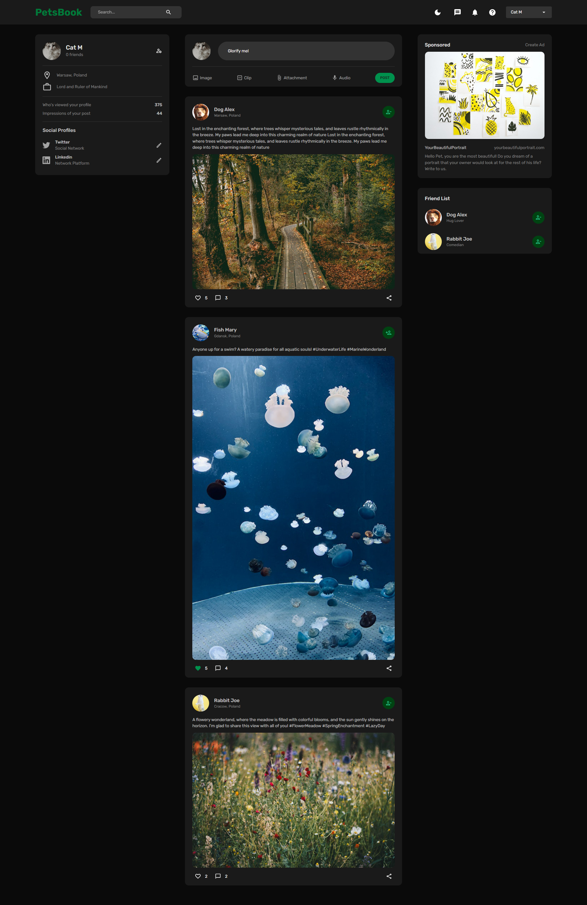
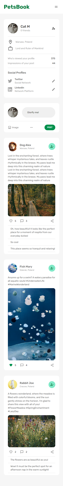

# PetsBook

PetsBook is a Fullstack Responsive MERN (MongoDB, Express, React, Node.js) App with authentication, likes, comments features, and dark mode.

## Table of contents

- [Overview](#overview)
  - [The challenge](#the-challenge)
  - [Screenshot](#screenshot)
- [My process](#my-process)
  - [Built with](#built-with)
  - [Continued development](#continued-development)

## Overview

Visit: ... 

### The challenge

Users should be able to:
- Create accounts and log in securely
- Compose and publish posts with text and photos
- Like and unlike posts from other users
- Leave comments on posts
- Create and manage friend circles to connect with other pets
- Toggle Dark Mode for a comfortable browsing experience
- Enjoy a responsive design that adapts to various devices and screen sizes 

### Screenshot

Desktop:
 

Mobile:
 

## My process

### Built with

- Express.js
- MongoDB
- Mongoose
- Nodemon
- JsonWebToken
- Multer
- Material UI
- Google Fonts
- React Redux
- React Router
- React Dropzone

and [EdRoh's Tutorial](https://www.youtube.com/watch?v=K8YELRmUb5o&t=15981s).

### Continued development

- Deploying
